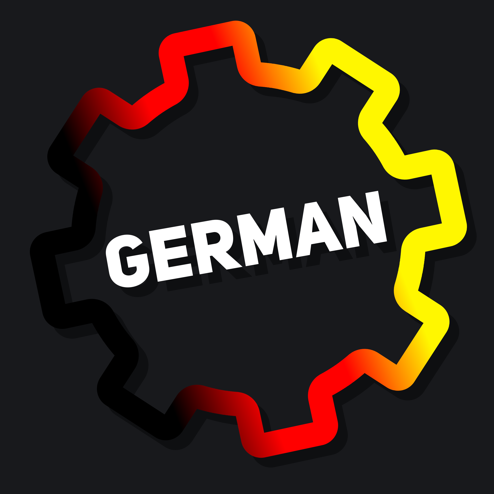

    
    <h1><b>DBM German Bot</b></h1>
    The official bot of the DBM German Discord server.

## License
This bot is licensed unter a [Creative Commons Attribution-NonCommercial-ShareAlike 4.0 International License](http://creativecommons.org/licenses/by-nc-sa/4.0/).

[]

## How to get started

1. Create a fork of the repository
1. Clone the fork to your local machine
2. Make sure Steam and of Discord Bot Maker 2.0 (unmodded!) are installed
   - Steam Client - [[Download](https://store.steampowered.com/about/)]
   - Discord Bot Maker 2.0 - [[Steam Website](https://s.team/a/682130)] [[Steam Client](steam://store/682130)]
3. Run the setup via `npm run setup`
4. Convert raw datas to DBM data files via `npm run to-dbm`
5. Open the project in DBM