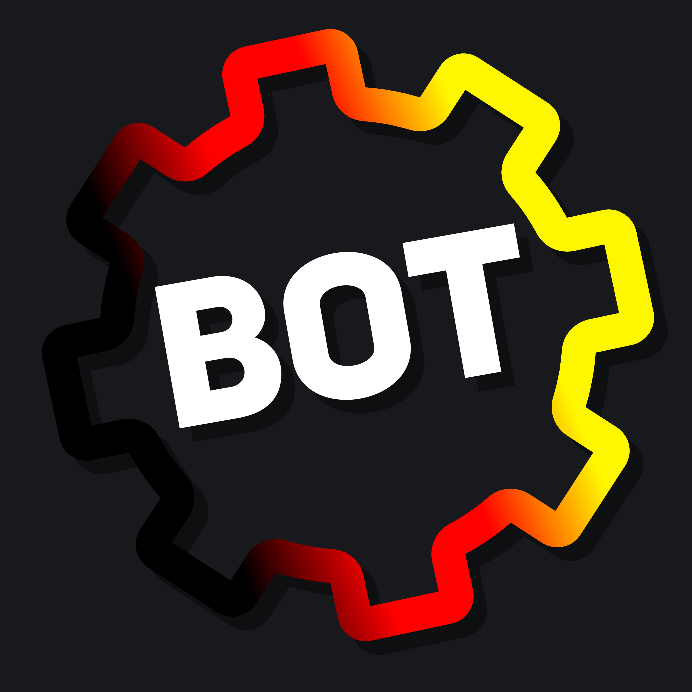

    
    <h1><b>DBM German Bot</b></h1>
    The official bot of the DBM German Discord server.

## License
This bot is licensed unter a [Creative Commons Attribution-NonCommercial-ShareAlike 4.0 International License](http://creativecommons.org/licenses/by-nc-sa/4.0/).

[]

## EN | How to get started

The following explains how to setup and start the bot. Please note that neither a bot token nor client id are provided. Should the used bot not be on the DBM German servers, the IDs in the initialization event have to be adjusted.

1. Create a fork of the repository (optional)
2. Clone the fork to your local machine
3. Make sure Steam and Discord Bot Maker 2.0 (without mods!) are installed
   - Steam Client – Download: https://store.steampowered.com/about/
   - Discord Bot Maker 2.0 – Steam Website: https://s.team/a/682130 | Steam Client: steam://store/682130
4. Run the setup via `npm run setup`
5. Open the project in DBM
6. Set a bot token in the settings
7. Start the bot using `npm run start`

## DE | Wie man loslegt

Nachfolgend wird erklärt, wie man den Bot aufsetzt und startet. Bitte beachte, dass weder Bot-Token noch Client-ID bereitgestellt werden. Sollte der verwendete Bot nicht auf den DBM German Servern sein, müssen die IDs im Initialisierungsevent angepasst werden.

1. Erstelle einen Fork von dem Repository (optional)
2. Klone den Fork auf deine lokale Maschine
3. Stelle sicher, dass Steam und Discord Bot Maker 2.0 (ohne Mods!) installiert sind
   - Steam Client – Download: https://store.steampowered.com/about/
   - Discord Bot Maker 2.0 – Steam Website: https://s.team/a/682130 | Steam Client: steam://store/682130
4. Führe das Setup aus via `npm run setup`
5. Öffne das Projekt in DBM
6. Lege einen Bot-Token in den Einstellungen fest
7. Starte den Bot mittels `npm run start`

## EN | How to edit the bot

Generally speaking, the bot should only be edited via DBM. Other changes can howevery be made manually in the `raw` or `res` folder.
For synchronization of all changes, there are the following scripts available.

| NPM script | Description                                                                                                       |
|------------|-------------------------------------------------------------------------------------------------------------------|
| to-dbm     | Raw data files in the folders `raw/commands` and `raw/events` get konverted to DBM files and saved in `bot/data`. |
| to-raw     | DBM files in the `bot/data` folder get konverted to raw data files and saved in `raw/commands` / `raw/events`.    |
| copy-code  | Additional code in the `raw/code` folder gets copied to `bot/code`.                                               |
| copy-res   | Resources in the `res` folder gets copied to `bot/resources`.                                                     |

## DE | Wie man den Bot bearbeitet

Grundsätzlich sollte der Bot nur über DBM bearbeitet werden. Sonstige Änderungen können jedoch auch manuell im `raw`- oder `res`-Ordner vorgenommen werden.
Zur Synchronisation aller Änderungen stehen nachfolgende Skripte zur Verfügung.

| NPM-Skript | Beschreibung                                                                                                                     |
|------------|----------------------------------------------------------------------------------------------------------------------------------|
| to-dbm     | Raw Data-Dateien in den Ordnern `raw/commands` und `raw/events` werden zu DBM-Dateien konvertiert und in `bot/data` gespeichert. |
| to-raw     | DBM-Dateien in dem `bot/data`-Ordner werden zu Raw Data-Dateien konvertiert und in `raw/commands` / `raw/events` gespeichert.    |
| copy-code  | Zusätzlicher Code in dem `raw/code`-Ordner wird nach `bot/code` kopiert.                                                         |
| copy-res   | Resourcen in dem `res`-Ordner werden nach `bot/resources` kopiert.                                                               |

## EN | How to run the bot with Docker

1. Build the Docker image via `npm run build`
2. Create a data directory or Docker volume on your host machine and copy the DBM data files into it
3. Open the copied `settings.json` and insert the bot token and client id
4. Start a container using `docker run` and a mount to the data directory

Example to start the bot with a mount to the sub-folder `data` of the current directory:

`docker run --mount type=bind,source="$(pwd)"/data,target=/home/node/app/data dbm-german-bot:3.0.0`

Optionally `--detach` and `--restart always` can be used to run the container in the background and restart it automatically.

## DE | Wie man den Bot mit Docker laufen lässt

1. Baue das Docker-Image via `npm run build`
2. Erstelle ein Daten-Verzeichnis oder Docker-Volume auf deinem Host-Rechner und kopiere die DBM-Datendateien hinein
3. Öffne die kopierte `settings.json` und füge den Bot-Token und die Client-ID ein
4. Starte den Container mittels `docker run` und einem Mount zum Daten-Verzeichnis

Beispiel zum Starten des Bots mit einem Mount zum Unterordner `data` im aktuellen Verzeichnis:

`docker run --mount type=bind,source="$(pwd)"/data,target=/home/node/app/data dbm-german-bot:3.0.0`

Optional können `--detach` und `--restart always` verwendet werden, um den Container im Hintergrund auszuführen und ihn automatisch neu zu starten.